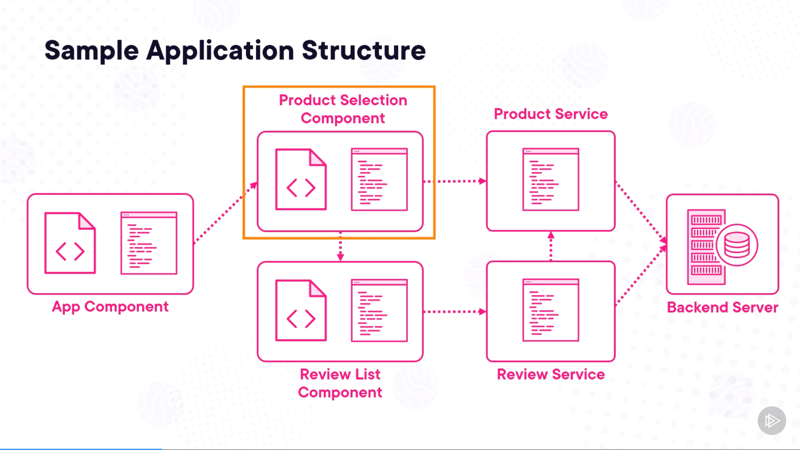

# Angular Signals — Creating, Reading, and Changing Signals

## Topics Covered

1. **Signal Syntax**
2. **Creating and Reading a Signal**
3. **Working with Arrays as Signals**
4. **Working with Objects as Signals**
5. **Changing a Signal's Value**
6. **`effect()` and Debugging Tips**

---

## Sample Application Structure

This application structure is used throughout the course.



```text
App Component
      ↓
Product Selection Component
      ↓
Product Service
      ↓
Backend Server

Product Selection Component
      ↓
Review List Component
      ↓
Review Service
      ↓
Backend Server
```

For now, the work starts in:

```text
Product Selection Component
```

where we create Signals for:

```text
products
selectedProduct
quantity
```

---

## Creating and Reading Signals

Create a Signal with:

```ts
signal(initialValue)
```

A Signal must always have an initial value.

Example:

```ts
quantity = signal(1);
```

Angular can infer the type from `1`:

```text
quantity
→ WritableSignal<number>
```

Read the Signal with:

```ts
quantity()
```

```text
quantity
→ Signal itself

quantity()
→ current value inside the Signal
```

A useful memory rule from the course:

```text
()
→ open the box
→ read the current value
```

When a template reads a Signal:

```text
Signal value is read
      ↓
Angular tracks that Signal as a dependency
      ↓
Signal changes later
      ↓
that part of the view can rerender
```

---

### Quantity Signal + Two-Way Binding

**File:**

```text
product-selection.ts
```

```ts
quantity = signal(1);
```

**Template:**

```html
<input
  class="quantityInput"
  id="quantity"
  type="number"
  [(ngModel)]="quantity">
```

Important:

```text
[(ngModel)]="quantity"
→ bind to the Signal itself
→ two-way binding reads and writes it
```

So here we use:

```text
quantity
```

not:

```text
quantity()
```

`ngModel` requires:

```ts
imports: [FormsModule]
```

---

### Arrays as Signals

A Signal can hold an array.

```ts
products = signal(ProductData.products);
```

Angular infers:

```text
WritableSignal<Product[]>
```

Read the array in the template:

```html
@for (product of products(); track product.id) {
  <option [ngValue]="product">
    {{ product.productName }}
  </option>
}
```

```text
products()
→ current Product[] value

@for
→ loop through the products

track product.id
→ unique identifier for each product
```

---

### Objects as Signals

The selected product is a `Product` object.

Initially, nothing is selected.

So the Signal needs to allow:

```text
Product
OR
undefined
```

```ts
selectedProduct =
  signal<Product | undefined>(undefined);
```

Why specify the type?

```text
signal(undefined)
→ Angular would infer only undefined

Product | undefined
→ tells Angular what the Signal may hold later
```

Bind the dropdown:

```html
<select [(ngModel)]="selectedProduct">
```

When the user selects a product:

```text
dropdown changes
      ↓
selectedProduct Signal changes
      ↓
product details can update
```

Read its properties with:

```html
{{ selectedProduct()?.productName }}
{{ selectedProduct()?.description }}
{{ selectedProduct()?.price }}
```

```text
selectedProduct()
→ read current product

?.
→ only access the property if a product exists
```

Calling Signal getter functions in templates is expected:

```text
selectedProduct()
products()
quantity()
```

These are Signal getter calls, not regular functions doing expensive work.

---

## Changing a Signal's Value

Two methods are introduced:

```text
set()
update()
```

### `set()`

Use `set()` when you know the exact new value.

```ts
quantity.set(5);
```

```text
quantity() = 1
      ↓
set(5)
      ↓
quantity() = 5
```

Memory rule:

```text
set()
→ replace with a specific value
```

---

### `update()`

Use `update()` when the new value depends on the current value.

```ts
this.quantity.update(
  q => q + 1
);
```

```text
q
→ current Signal value

q + 1
→ new value

update()
→ stores the result
```

Example:

```text
1
↓
q + 1
↓
2
```

For decrease:

```ts
this.quantity.update(
  q => q <= 0 ? 0 : q - 1
);
```

```text
q <= 0
→ keep 0

otherwise
→ subtract 1
```

So:

```text
set()
→ exact new value

update()
→ new value based on current value
```

---

## `effect()` and Debugging Tips

An `effect()` runs code when the Signals it reads change.

```ts
qtyEffect = effect(
  () => console.log(
    'quantity:',
    this.quantity()
  )
);
```

Because the effect reads:

```ts
this.quantity()
```

Angular tracks `quantity` as a dependency.

```text
quantity changes
      ↓
effect is scheduled
      ↓
effect runs
      ↓
current quantity is logged
```

This makes `effect()` useful for debugging Signal changes.

---

### Effects Are Scheduled

The course emphasizes that effects are **scheduled**.

If a Signal changes several times before the effect runs:

```text
2
↓
42
↓
12
```

the effect may run afterward and read only:

```text
12
```

So:

```text
effect()
→ does not necessarily run immediately after every individual change
→ it runs when scheduled and reads the current value
```

---

### Debugging Rules to Remember

Do not reassign a Signal.

Avoid:

```ts
this.quantity = 5;
```

Use:

```ts
this.quantity.set(5);
```

or:

```ts
this.quantity.update(
  q => q + 1
);
```

Also keep this distinction clear:

```text
Signal itself
→ quantity

Signal value
→ quantity()
```

Use the Signal itself when:

```text
two-way binding
set()
update()
```

Use the Signal value when:

```text
displaying it
logging it
using it in calculations
```

---

## Dependency Tracking and Memoization

When a Signal is read inside reactive code:

```text
Angular tracks it as a dependency
```

For a computed Signal:

```text
computed reads Signal
      ↓
dependency is tracked
      ↓
dependency changes
      ↓
computed runs again
```

The computed result is also memoized:

```text
computed result
      ↓
stored by Angular
      ↓
read again
      ↓
reuse stored result
```

It recalculates when one of its tracked dependencies changes.

---

## How Everything Connects

```text
ProductData.products
      ↓
products Signal
      ↓
products()
      ↓
@for
      ↓
Product dropdown
      ↓
user selects product
      ↓
selectedProduct Signal
      ↓
selectedProduct()
      ↓
Name / Description / Price
```

And for quantity:

```text
quantity Signal
      ↕
[(ngModel)]
      ↕
Quantity input

+ / - buttons
      ↓
update()
      ↓
quantity changes
      ↓
UI reacts
```

---

## Signals Cheat Sheet

```ts
quantity = signal(1);
```

```text
signal()
→ create writable Signal
```

```ts
quantity()
```

```text
→ read current Signal value
```

```html
[(ngModel)]="quantity"
```

```text
→ bind to Signal itself
→ reads + writes
```

```ts
products = signal(ProductData.products);
```

```text
→ array Signal
```

```ts
selectedProduct =
  signal<Product | undefined>(undefined);
```

```text
→ object Signal
→ can hold Product or undefined
```

```ts
quantity.set(5);
```

```text
set()
→ exact new value
```

```ts
quantity.update(
  q => q + 1
);
```

```text
update()
→ new value from current value
```

```ts
effect(
  () => console.log(quantity())
);
```

```text
effect()
→ reacts to Signals it reads
→ useful for debugging
→ execution is scheduled
```

```text
Signal itself
→ quantity

Signal value
→ quantity()
```
